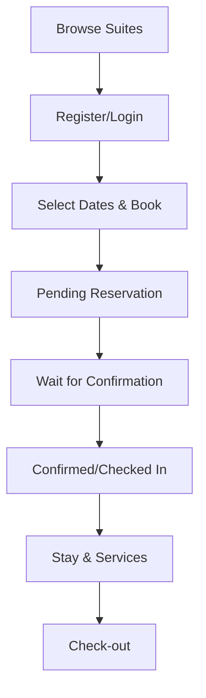

# Kingsman Hotel System Guide

A comprehensive overview of the Kingsman Hotel management system, documenting its architecture, core flows, and security protocols.

---

## 🏗️ System Architecture
The system is built as a traditional **PHP/MySQL** application, focusing on high-end hospitality management. It follows a modular structure where administrative and guest functionalities are clearly separated but share core data via a central database.

### Core Directory Structure
- `/admin/`: Contains all administrative modules (Dashboard, Room Management, Bookings, Guest relations).
- `/config/`: Includes `db.php` for PDO database connections.
- `/includes/`: Shared components like headers, footers, and mail helpers.
- `/assets/`: System assets including images, styles, and scripts.
- `/user/`: Guest-specific modules and dashboard.
- `/vendor/`: Composer dependencies (mostly for mail handling).

---

## 🔒 Authentication & Security

### Password Handling
- **Hashing**: All passwords are encrypted using PHP's standard `password_hash()` with `PASSWORD_DEFAULT` (Bcrypt).
- **Verification**: Securely checked via `password_verify()` during login.
- **Role-Based Access**: A single `users` table manages both Guests and Admins using a `role` column (`user` or `admin`).

### Security Flows
1. **Registration**: Guest signs up -> Password hashed -> OTP generated -> Email sent for verification.
2. **Verification**: Account remains `is_verified = 0` until the correct OTP is provided in `verify.php`.
3. **Login**: Checks for email match, password validity, verification status, and account status (e.g., if blocked by admin).

---

## 🔄 Core System Flows

### 1. Guest Lifecycle Flow

- **Booking Utility**: `book_room.php` implements a complex SQL check to ensure no overlapping bookings exist for a specific room type before allowing a reservation.

### 2. Administrative Workflow
#### Booking Management
- **Pending**: New reservations appear in the admin panel.
- **Confirm**: Admin confirms the stay; guest receives an automated "Reservation Confirmed" email.
- **Check-In**: Admin assigns a specific room from available inventory.
- **Check-Out**: Admin process check-out; system automatically marks the room as `available` for future guests.

#### Room & Inventory Management
- Admins can create **Room Categories** (e.g., Executive Suite) and manage individual **Rooms** within those categories.
- Inventory status (Available/Occupied/Maintenace) is dynamically updated based on booking activities.

---

## 🔑 Account Access

Use the following default credentials for testing and management.

### 💼 Admin Portal
- **URL**: `/admin/`
- **Email**: `admin@kingsman.com`
- **Password**: `password123`

### 👤 Guest Portal
- **URL**: `/login.php`
- **Email**: `james.r@gmail.com`
- **Password**: `password123`

---

## 📊 Database Highlights
Key tables driving the system:
- `users`: Core identity table for both guests and staff.
- `room_types`: Defines categories, pricing, and amenities.
- `rooms`: Physical room inventory linked to categories.
- `bookings`: Central record for all stays, including dates and status transitions.
- `payments`: Tracks financial records associated with bookings.
- `notifications`: Real-time system notifications for users.

---

---

## 🚀 Setup & Installation

### 1. Database Configuration
1. Import `hotel_db.sql` into your MySQL server (via phpMyAdmin or CLI).
2. Configure your credentials in `config/db.php`.

### 2. Dependency Management
Since the `vendor/` directory is excluded from the repository, run the following command to install required libraries (like PHPMailer):
```bash
composer install
```

### 3. Mail Configuration
This system uses PHP's native `mail()` function. For local development on XAMPP, refer to the:
👉 **[MAIL_SETUP_GUIDE.md](file:///c:/xampp/htdocs/kingsman/MAIL_SETUP_GUIDE.md)**

---

> [!IMPORTANT]
> This system is designed for high-end privacy (Bespoke Service). Admins have manual control over confirmations to ensure premium service quality.
